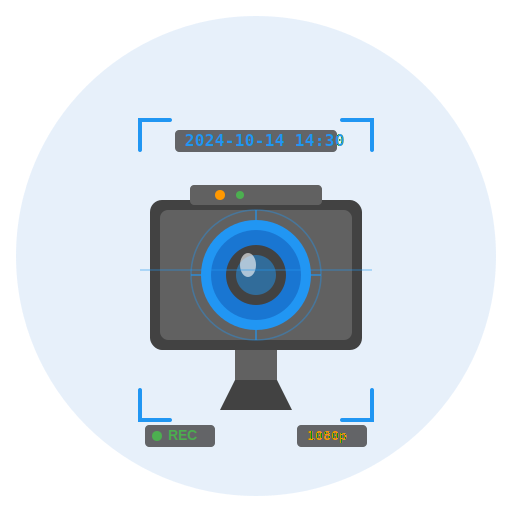

# Camera Snapshot Processor

<p align="center">
  
</p>

[](https://github.com/hacs/integration)


[](https://github.com/Patras3/camera-snapshot-processor/actions/workflows/security.yml)
[](https://github.com/Patras3/camera-snapshot-processor/actions/workflows/codeql.yml)

A powerful Home Assistant custom integration that processes camera snapshots with advanced image manipulation, overlay capabilities, and a professional web-based configuration UI.

## Key Features

### 🎨 Professional Web UI
- **Visual Configuration Panel**: Modern, responsive web interface for all settings
- **Live Preview**: See changes in real-time as you configure
- **Interactive Crop Tool**: Drag and resize crop regions visually on the preview
- **Rich Entity Search**: Searchable dropdown with entity details and domains
- **State Icon Manager**: Professional icon picker with full Material Design Icons library (loaded from CDN)

### 🖼️ Image Processing
- **Flexible Resizing**: Scale images with or without maintaining aspect ratio (1-7680px width, 1-4320px height)
- **Visual Cropping**: Interactive crop tool with live preview
- **Quality Control**: Adjustable JPEG compression (1-100%)
- **High Performance**: In-memory processing with minimal overhead

### 📝 Advanced Overlays
- **Date/Time Stamp**: Custom format using Python strftime
- **Custom Text**: Static text or Home Assistant templates
- **Multi-State Icons**: Configure different icons, text, and colors for each entity state
  - Support for complex conditions (equals, not equals, contains, greater than, less than, in list, etc.)
  - Template support for dynamic text (e.g., `{{ relative_time(...) }} ago`)
  - Real-time template preview with error detection
  - Per-state customization: icon, text, colors, background fill
- **Flexible Positioning**: Place overlays in any corner
- **Rich Styling**: Custom colors, font sizes, and backgrounds with transparency

### 🎥 Stream Support
- **Stream Passthrough**: Use original camera's stream
- **Custom RTSP**: Optional override with custom RTSP URL
- **API Compatible**: Works with Home Assistant's camera proxy API

## Screenshots

### Main Configuration Panel
The professional web interface provides visual configuration with live preview:
- Split-screen layout: configuration on the left, live preview on the right
- Tabbed interface for organized settings (Dimensions, Crop, Overlays, State Icons, Stream)
- Real-time preview updates as you change settings

### Interactive Crop Tool
Visual crop editor with drag-and-resize handles:
- Click "Enable Visual Crop Editor" to activate
- Drag the crop box to reposition
- Resize using corner handles
- Coordinates auto-update in the form

### State Icon Manager
Professional icon picker and multi-state configuration:
- **Full MDI Library**: Material Design Icons loaded dynamically from CDN
- **Curated Categories**: Commonly-used icons organized by category (CCTV, Motion Detection, Alarms, Lights, Security, etc.)
- **Search Functionality**: Find any icon using "mdi:icon-name" format
- Multi-state rules with complex conditions
- Live template rendering in preview with error detection
- Color pickers for icon and text colors
- Icon background fill option for solid/filled appearance

## Installation

### HACS (Recommended)

1. Open HACS in your Home Assistant instance
2. Click on "Integrations"
3. Click the three dots in the top right corner
4. Select "Custom repositories"
5. Add this repository URL: `https://github.com/Patras3/camera-snapshot-processor`
6. Select category: "Integration"
7. Click "Add"
8. Find "Camera Snapshot Processor" in the integration list
9. Click "Download"
10. Restart Home Assistant

### Manual Installation

1. Download the latest release from GitHub
2. Copy the `custom_components/camera_snapshot_processor` folder to your Home Assistant's `custom_components` directory
3. Restart Home Assistant

## Quick Start

### Initial Setup

1. Go to **Settings** → **Devices & Services**
2. Click **+ Add Integration**
3. Search for "Camera Snapshot Processor"
4. Click **Submit** to complete setup
5. Find **Snapshot Processor** panel in your Home Assistant sidebar

### Adding and Configuring Cameras

All camera configuration is done through the **Snapshot Processor** panel in your sidebar:

1. **Open the panel**: Click "Snapshot Processor" in your sidebar (left panel)
2. **Add a camera**: Click the "➕ Add Camera" button
3. **Select source**: Choose a camera from your available cameras list
4. **Configure with live preview**:
   - **Dimensions tab**: Set width, height, aspect ratio, quality
   - **Crop tab**: Enable cropping with visual editor or manual coordinates
   - **Overlays tab**: Add date/time stamps and custom text
   - **State Icons tab**: Add dynamic icons that change based on entity states
   - **Stream tab**: Optionally configure custom RTSP stream URL
5. **Watch preview**: Changes update in real-time on the right panel
6. **Save**: Click "💾 Save" button to apply your configuration

### Configuring State Icons

State icons allow you to display different icons and text based on entity state:

1. In the Snapshot Processor panel, select your camera
2. Go to the **State Icons** tab
3. Click **Add State Icon**
4. Configure:
   - **Entity**: Select the entity to monitor (lights, sensors, locks, etc.)
   - **Label**: Optional label text (e.g., "Living Room")
   - **Position**: Choose corner placement
   - **Font Size**: Adjust icon and text size
5. Add state-specific rules:
   - Click **Add State Rule** for each state you want to customize
   - Set **Condition** (equals, not equals, contains, etc.)
   - Choose **Icon** using the visual picker (7,000+ MDI icons from CDN)
   - Set **Text** (static or template like `{{ states('sensor.temp') }}°C`)
   - Pick **Colors** for icon and text
   - Enable **Icon Background** for filled/solid icons
6. Templates render in real-time - see the actual result or `<error>` with details
7. Click **Save Configuration** when done

## Configuration Examples

### Example 1: Simple Resized Camera with Timestamp

Source: 4K camera (3840×2160)
Output: Full HD (1920×1080) with date/time in bottom-right

Settings:
- Width: 1920, Height: 1080
- Keep aspect ratio: Yes
- DateTime enabled: Yes, position bottom-right
- Format: `%Y-%m-%d %H:%M:%S`

### Example 2: Cropped Door Camera with State Indicator

Source: Wide-angle hallway camera
Output: Cropped to door area with lock status

Settings:
- Crop: X=800, Y=200, Width=1200, Height=900
- Width: 640, Height: 480
- State Icon:
  - Entity: `lock.front_door`
  - States:
    - Locked: `mdi:lock` (red)
    - Unlocked: `mdi:lock-open` (green)

### Example 3: Multi-State Temperature Sensor

Source: Any camera
Output: Shows temperature with color-coded icon

Settings:
- State Icon:
  - Entity: `sensor.living_room_temperature`
  - States:
    - Greater than 25: `mdi:thermometer` (red), text: `{{ states('sensor.living_room_temperature') }}°C`
    - Less than 18: `mdi:snowflake` (blue), text: `{{ states('sensor.living_room_temperature') }}°C`
    - Default: `mdi:thermometer` (white), text: `{{ states('sensor.living_room_temperature') }}°C`

## Using in Automations

```yaml
automation:
  - alias: "Save processed snapshot on motion"
    trigger:
      - platform: state
        entity_id: binary_sensor.front_door_motion
        to: "on"
    action:
      - service: camera.snapshot
        target:
          entity_id: camera.front_door_processed
        data:
          filename: "/config/www/snapshots/motion_{{ now().strftime('%Y%m%d_%H%M%S') }}.jpg"
```

## Accessing Snapshots via API

Processed snapshots are available through Home Assistant's camera proxy:

```
http://<your-ha-url>:8123/api/camera_proxy/camera.<camera_name>_processed?token=<long-access-token>
```

Get the token from **Settings** → **Your Profile** → **Long-Lived Access Tokens**.

## Template Examples

State icon text supports Home Assistant templates:

- Current state: `{{ states('sensor.temperature') }}°C`
- Relative time: `{{ relative_time(states.sun.sun.last_changed) }} ago`
- Attribute: `{{ state_attr('sun.sun', 'elevation') }}°`
- Conditional: `{{ 'Hot' if states('sensor.temp')|float > 25 else 'Cool' }}`

Use the **🧪 Test Template** button in the state icon manager to test templates in real-time!

## Technical Details

### Requirements

- Home Assistant ≥ 2025.9.4
- Python ≥ 3.11
- Pillow ≥ 10.0.0 (auto-installed)

### Image Processing Pipeline

1. Fetch snapshot from source camera
2. Load image into memory (Pillow)
3. Apply cropping (if enabled)
4. Resize with aspect ratio handling
5. Render overlays:
   - Date/time with custom format
   - Custom text (static or template)
   - State icons with conditional rendering
6. Compress to JPEG with specified quality
7. Return processed bytes

### State Icons Processing

1. Check entity current state
2. Evaluate rules in order (first match wins)
3. Render templates if text_template is enabled
4. Select appropriate icon, text, and colors
5. Render using MDI font or emoji
6. Apply icon background fill if enabled
7. Composite onto image at specified position

### API Compatibility

- `async_camera_image()`: Returns processed snapshot
- `stream_source()`: Proxies to original camera's stream
- Camera proxy API: `/api/camera_proxy/camera.<entity_id>`
- Frontend API: `/api/camera_snapshot_processor/*` for web UI

## Troubleshooting

### Camera Not Appearing

- Restart Home Assistant after installation
- Check logs: **Settings** → **System** → **Logs**
- Verify source camera is working

### Image Processing Errors

- Verify source camera provides valid images
- Check crop coordinates don't exceed image bounds
- Review logs for specific error messages

### Template Errors

- Use the **🧪 Test Template** button to validate templates
- Hover over `<error>` in preview to see error details
- Ensure entity IDs exist and are spelled correctly
- Use proper Jinja2 syntax with `{{ }}` delimiters

### Web UI Not Loading

- Clear browser cache and refresh
- Check browser console for errors
- Verify integration is properly installed
- Check Home Assistant logs for frontend errors

## Performance

- Processes images in-memory (no disk I/O)
- Efficient Pillow operations with font caching
- Suitable for frequent polling (1 minute intervals, 10+ cameras)
- No caching - always fresh images
- Template rendering cached per render cycle
- Minimal CPU overhead

## Security

**Primary Security**: This integration relies on Home Assistant's security model. Camera Snapshot Processor is a lightweight image processing layer that inherits Home Assistant's authentication, credential storage, and sandboxing.

### Automated Scanning

- **Daily CVE Scans**: Dependencies scanned for known vulnerabilities (pip-audit)
- **CodeQL Analysis**: Automated code security analysis
- **Dependabot**: Automatic dependency update PRs

### Design Principles

- **Minimal Dependencies**: Only Pillow library required
- **No Network Exposure**: Runs entirely within Home Assistant
- **Credential Sanitization**: RTSP URLs sanitized in debug logs (`***:***@`)
- **Home Assistant Security**: Inherits authentication, encryption, and access control

### Reporting Issues

Found a security concern? Use [GitHub Issues](https://github.com/Patras3/camera-snapshot-processor/issues) or [Security Advisory](https://github.com/Patras3/camera-snapshot-processor/security/advisories/new). This is a hobby project, so fixes are released on a normal schedule (unless critical).

## Contributing

Contributions are welcome! Please:
1. Fork the repository
2. Create a feature branch
3. Make your changes
4. Test thoroughly
5. Submit a pull request

## Support

- **Issues**: [GitHub Issues](https://github.com/Patras3/camera-snapshot-processor/issues)
- **Feature Requests**: [GitHub Discussions](https://github.com/Patras3/camera-snapshot-processor/discussions)

## License

This project is licensed under the MIT License - see the LICENSE file for details.

## Credits

Created by [@Patras3](https://github.com/Patras3)

With special thanks to the Home Assistant community for feedback and testing.

## Changelog

### Version 1.0.0 (2025-10-13)

**Initial stable release** of Camera Snapshot Processor.

**Features:**
- Professional web-based configuration panel with live preview
- Interactive visual crop editor with drag-and-resize
- Advanced state icon manager with **full MDI library** (7,000+ icons loaded from CDN)
- Multi-state support with complex conditions (equals, not equals, contains, gt, lt, in list, etc.)
- Home Assistant template support for dynamic text with real-time preview
- Real-time template error detection with helpful messages
- Rich entity search with domain tags
- Per-state customization (icon, text, colors, icon background fill)
- Icon background fill option for solid/filled icon appearance
- Template testing directly in UI with "🧪 Test Template" button
- "📊 Use Entity State" button for quick template insertion
- **CDN-powered icon loading**: All Material Design Icons available without bloating repository

**Technical:**
- Complete UI redesign with modern, responsive interface
- Split-screen layout with live preview
- Tabbed configuration for better organization
- MDI icons rendered using official CSS library
- **Smart icon translation**: Frontend translates icon names to Unicode at config-time for zero runtime overhead
- Curated icon categories with search for all MDI icons
- Improved color pickers with RGB/RGBA support
- Comprehensive error handling and user feedback
- RTSP URL credential sanitization in logs
- Orphaned entity cleanup
- Home Assistant 2025.12+ compatibility

**Quality:**
- Code quality: Passes black, isort, flake8 with zero violations
- Security: Daily CVE scans, CodeQL analysis, Dependabot monitoring
- Performance: Suitable for 10+ cameras with 1-minute polling intervals
- Compatibility: Home Assistant ≥ 2025.9.4, Python ≥ 3.11
